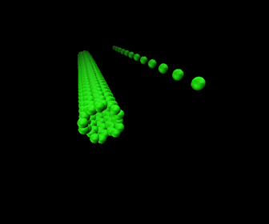

# Strain_CGMD
- project_directory from Aug. 2016 to Sep. 2019
- collaborated with Prof. Shohei Chiashi, Prof. Junichiro Shiomi and Prof. Shigeo Maruyama @ The Univ. of Tokyo

## Code work for Strain CGMD
  Nonlinear bending motion of single walled carbon nanotubs(SWCNT) calculated using molecular dynamic (MD) simulation using cantilevered SWCNT (Koh et al., PRB 2015) has been depicted using coarse grained molecular dynamics (CGMD), which is modeled as a simple beads system.
  
  
#### Simulation model
- SWNT (5,5) at 300 K
- one end fixed as 0 K
- Results in animated GIF: nonlinear motion calculated by CGMD and MD simulation
- CGMD simulation shares the initial displacement and velocity only with that of MD simulation

  
Left : 5 times amplified from MD simulation, Right : 15 times amplified UA 60 in CGMD

#### input data for this model is in https://drive.google.com/open?id=1a17F_jgNmaAdU6IK9HGAQ6gchxtW5JFl

 
#### Poster session
- H. Koh, Y. Yoshimoto, S. Chiashi, J. Shiomi and S. Maruyama, Free thermal vibration of SWNT and its modeling in CGMD simulation, Sendai, Japan, FNTG, September, 2018.
- H. Koh, Y. Yoshimoto, S. Chiashi, J. Shiomi and S. Maruyama, Free thermal vibration of SWNT and its modeling in CGMD simulation, Ulsan, South Korea, Soft matter summer school from KIAS, June, 2019.
#### Oral session 
- H. Koh, Y. Yoshimoto, S. Chiashi, J. Shiomi and S. Maruyama, Free thermal vibration of SWNT and its modeling in CGMD simulation, Jeju, South Korea, ENGE, November, 2018.
#### Related article 
- On preparation for journal paper 
